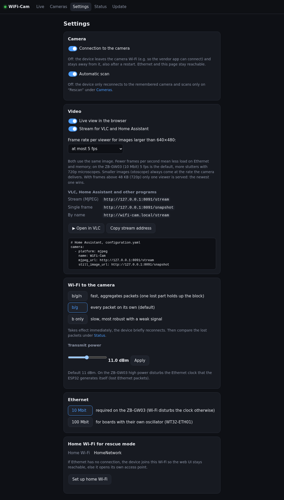
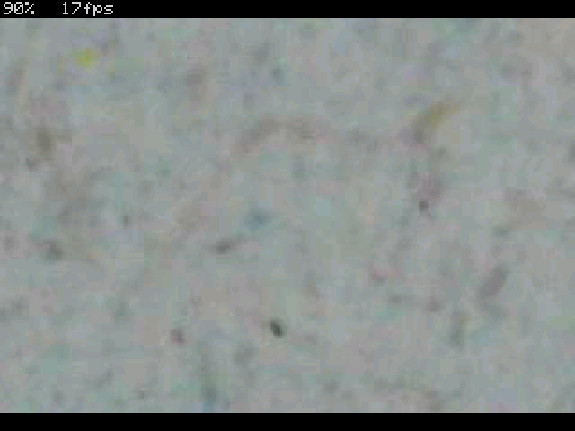
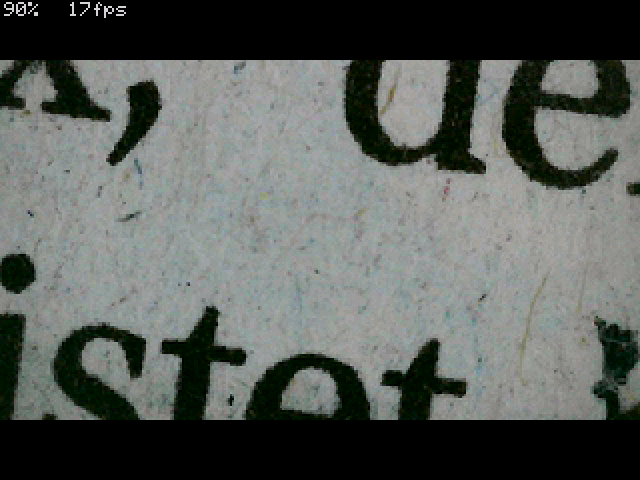
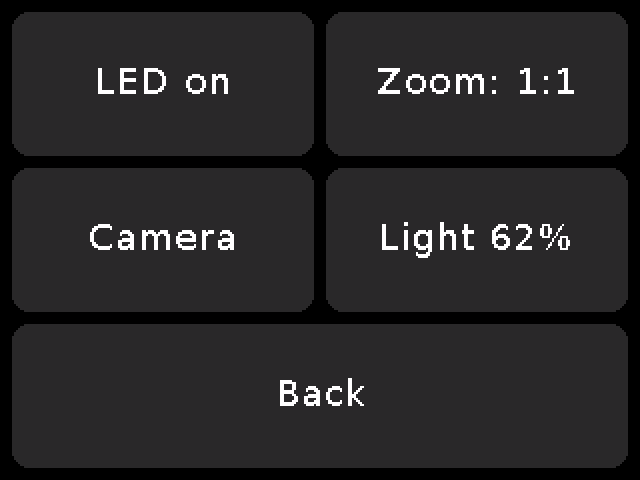
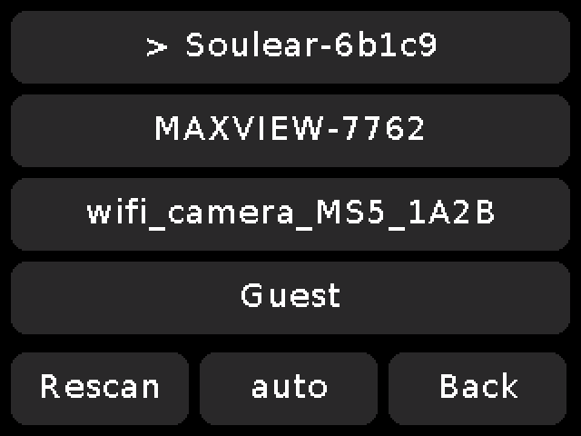
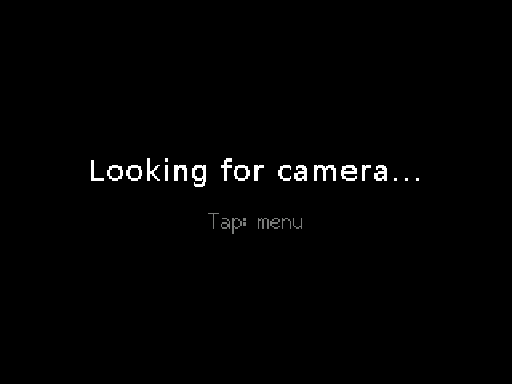
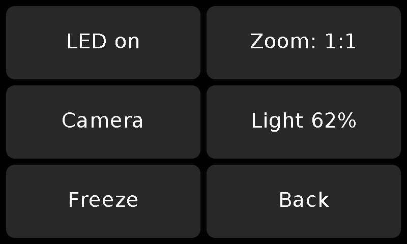

# WiFi-Cam-Proxy

> **Note:** the code and the documentation of this project were written by an AI (Claude, Anthropic)
> under human direction and tested on real hardware. Review it before relying on it.

Cheap Wi-Fi otoscopes, ear-cleaner cameras and Wi-Fi microscopes open their own Wi-Fi and speak
proprietary but unencrypted UDP protocols. Viewing them normally requires the vendor's app,
sometimes with a cloud licence check.

This project replaces the app with a small **ESP32 with Ethernet**. It connects to the camera via
Wi-Fi and provides the image in the home network over Ethernet:

```
[Wi-Fi camera] <--Wi-Fi--> [ESP32 + LAN8720] <--Ethernet--> [home network]
 otoscope/microscope          this proxy                     http://wifi-cam.local/
```

- **MJPEG stream** for browsers, VLC and Home Assistant (`/stream`), single frame (`/snapshot`)
- **Cameras are detected automatically** by their Wi-Fi name (SSID). If several are in range,
  you choose one in the web UI (`/cameras`).
- **Orientation correction** in the browser for otoscopes with an orientation sensor: the image
  rotates along when the probe is turned. There is a calibration page for it.
- **Zoom 1×, 2×, 4×** in the browser (button or double-click, drag to pan) and a **freeze** button
  (still image). With cameras that have buttons (MAX-VIEW: zoom and photo; Soulear otoscope:
  photo) they control zoom and freeze. The image arrives square;
  cropping it round is optional.
- **Battery level and LED** of the camera, as far as the protocol knows them
- Firmware update in the browser, crash backtrace in `/status`
- **Rescue mode** without Ethernet: home Wi-Fi or own access point `WiFi-Cam-XXXX` with a setup
  page (captive portal, like the Arduino WiFiManager)

## Screenshots

<p align="center">
  
  
</p>
<p align="center">
  
  
  
  
</p>

The screenshots come from the [UI preview](tools/ui-preview/) with simulated device data; the
camera picture is a real one taken with the device.

## Supported cameras

| Family | Detection (SSID starts with) | Devices | Image | Orientation | Battery | LED | Status |
|---|---|---|---|---|---|---|---|
| **i4season** | `Soulear`, `SUEAR`, `i4season`, `inskam`, `Yanxuan`, `wifi_camera_` | Hopefox Find T (Soulear app), MS5 microscope | ✅ | ✅ (if present) | ✅ | ✅² | Soulear proven on the device |
| **MaxSee / JoyHonest** (`JHCMD`) | `Maxsee`, `JH-`, `MAX-VIEW`/`MAXVIEW`¹ | Wi-Fi microscopes at `192.168.29.1`, e.g. MAX-VIEW (1280×720) | ✅ | – | ✅³ | ✅ dimmable (MAX-VIEW) | MAX-VIEW proven on the ZB-GW03 |

¹ Although the MAX-VIEW app is by i4season, the microscope (`MAXVIEW-xxxx`) sits at `192.168.29.1`
and speaks JHCMD. With the protocol "automatic" the firmware asks the camera: each protocol has a
short probe, and the first that gets an answer wins (see [firmware/README.md](firmware/README.md#cameras)).
Under `/cameras` the protocol can also be chosen per network.
² Implemented from the protocol documentation, not yet checked on our own device.
³ MAX-VIEW: in 10 % steps, derived from the vendor app's display (checked from 10 to 80 %); the
value is too high while charging.

Other families such as EarFairy (RTSP), JEGOAT, Xylla and iTiMO find their Wi-Fi via Bluetooth LE
or need RTSP. They are not implemented on the ESP32 yet. More on this in
[docs/handover-research.md](docs/handover-research.md).

**720p microscopes:** an ESP32 without PSRAM has only a little more than 100 KB of RAM for frames.
Frames above 48 KB are only accepted while enough memory remains free. Otherwise they are dropped
and counted as `drop_nomem` under `/status`. At 1280×720 that can happen often. The MAX-VIEW sends
34–84 KB per frame. With frames above 48 KB only one viewer gets the stream: the newest one
wins, older stream connections end (several viewers each holding a large frame emptied the heap).
When a new frame does not fit, the stored one is given up if nobody is sending it.

## Hardware

| Board | Ethernet clock | Ethernet | Note |
|---|---|---|---|
| **ZB-GW03 v1.4** (Zigbee gateway, reflashed) | GPIO17, generated by the ESP32 | 10 Mbit | Wi-Fi reception disturbs the clock at 100 Mbit. 10 Mbit is enough for 3 viewers. Runs reliably. |
| **WT32-ETH01** | GPIO0, own oscillator | 100 Mbit | configured from the datasheet, not yet tested on the device |
| **CYD ESP32-2432S028R** ("Cheap Yellow Display") | – | no Ethernet | shows the image directly on the 2.8" display (touch menu), see below. Tested with the Soulear (ILI9341 variant) |
| **Freenove ESP32-S3 Display FNK0115** (IPS, 800×480) | – | no Ethernet | like the CYD on a 5" or 4.3" display, see below. Tested with the MAX-VIEW (5" IPS) |

Pins and board selection are in [firmware/include/config.h](firmware/include/config.h).

### Own build on a breadboard (ESP32 DevKit + LAN8720 module, not tested)

The chip combination is the same as on the WT32-ETH01 (ESP32 + LAN8720 with a 50 MHz clock on
GPIO0), so the `wt32-eth01` environment is the one to use. The ESP32's RMII pins are fixed by the
chip, the two management pins and the power pin are set in `config.h`:

| LAN8720 module | ESP32 | |
|---|---|---|
| TXD0, TX_EN, TXD1 | GPIO19, GPIO21, GPIO22 | fixed (RMII) |
| RXD0, RXD1, CRS_DV | GPIO25, GPIO26, GPIO27 | fixed (RMII) |
| nINT/REFCLKO (50 MHz out) | GPIO0 | clock input, `ETH_CLOCK_GPIO0_IN` |
| MDC, MDIO | GPIO23, GPIO18 | `ETH_MDC_GPIO`, `ETH_MDIO_GPIO` |
| (oscillator power) | GPIO16 | `ETH_POWER_GPIO`, see below |
| VCC, GND | 3V3, GND | |

What to watch out for:

- **Boot and the clock on GPIO0:** GPIO0 selects the boot mode at reset. A module that clocks GPIO0
  all the time can make the ESP32 start in download mode now and then. The WT32-ETH01 avoids this
  by switching its oscillator with GPIO16. A bare module has no such switch: either supply its VCC
  through a transistor driven by GPIO16 (the module draws more than a GPIO can give), or pull the
  clock wire off GPIO0 for the reset.
- **PHY address:** `config.h` uses address 1 (as the WT32-ETH01). Many modules answer on 0: if
  there is no link, set `ETH_PHY_ADDR_GW` to 0 (or -1 to detect it).
- **Wires:** RMII runs at 50 MHz. Keep the wires short, with a good common ground, or the link may
  stay down or drop packets.
- **Not the ZB-GW03 variant:** it needs the ESP32 to generate the clock on GPIO17 into a PHY
  without its own crystal. A module with a crystal cannot take that.

### CYD as a camera display

With `pio run -e cyd -t upload` the CYD becomes a standalone display device: it looks for the
camera like the bridge and shows the centre 320×240 crop at full resolution (zoom 1:1).
Alternatively it shows the whole image scaled down ("fit") or enlarged 2× or 4×, and the menu has
a freeze button (still image); the camera's buttons control both. If the processor is slower
than the camera, frames drop out by themselves; the newest frame is always shown. Tapping the
image opens the menu with LED, zoom, camera choice and brightness. In the camera choice a button
switches the protocol for the next connection (automatic → i4season → JHCMD). There is no orientation
correction: arbitrary angles would need a frame buffer that does not fit without PSRAM, and in
90° steps the image jumped back and forth in the hand. 720p microscopes fail on RAM just like with the
bridge. Code: [firmware/src/main_cyd.cpp](firmware/src/main_cyd.cpp).

<p align="center">
  
  
  
</p>
<p align="center">
  
  
</p>

The CYD screenshots are drawn by the real display code on the host ([tools/cyd-preview](tools/cyd-preview/)).

With the Soulear it showed about 11–12 fps at 1:1 and 7–8 fps at "fit"; the JPEG decoder is the
limit, not Wi-Fi. Since then decoding and display transfer overlap (DMA), the decoder runs on the
core without Wi-Fi, with `-O2` and 80 MHz flash (takes effect after a flash over USB); not yet
measured. Measurements: [project documentation, section 4.6](docs/project-documentation.md#46-cyd-display-path-and-measurements).
Without a local USB port, `firmware/.pio/build/cyd/firmware.factory.bin` can also be flashed at
address 0x0 with a web serial flasher (e.g. esptool-js).

### Freenove FNK0115 as a camera display

The [Freenove ESP32-S3 Display](https://github.com/Freenove/Freenove_ESP32_S3_Display_FNK0115)
with the 800×480 IPS panel (FNK0115Q 5.0", FNK0115L 4.3") runs the same display code as the CYD:
`pio run -e fnk0115 -t upload` (USB, CH340 with auto-reset). Texts and buttons are twice as
large, and at 1:1 the 480×480 otoscope image fits whole. The board has an ESP32-S3
(N16R8: 16 MB flash, 8 MB octal PSRAM; the schematic says N8R2). The panel shows one of three
frame buffers in the PSRAM and each live frame whole (no tearing). Touch is a GT911. Panel, touch and
backlight are set up in [lgfx_fnk0115.h](firmware/include/lgfx_fnk0115.h); if the image drifts
or flickers, lower `FNK_PCLK_HZ` in `config.h`. The TN variants (FNK0115B/R, resistive touch)
are not supported.

<p align="center">
  
  
</p>

## Installation and build

You need a computer with Linux or macOS (Debian/Ubuntu tested), `git`, `python3` with `venv`, about
2 GB of disk space and an internet connection for the first build. On Windows use WSL2, or install
PlatformIO yourself (`pip install platformio`) and skip step 2. Flashing needs a USB-UART adapter or
a board with USB; a build in WSL can be flashed with a web serial flasher (see step 5).

**1. Get the code**

```bash
git clone https://github.com/HeikoGr/wifi-cam-proxy.git
cd wifi-cam-proxy
```

**2. Set up the build environment** (once)

```bash
./setup-build-env.sh      # PlatformIO in .venv, creates firmware/include/secrets.h, loads the toolchain (~1 GB)
source .venv/bin/activate # then `pio` is available directly
```

**3. Optional settings:** in `firmware/include/secrets.h` you can set an OTA password and the password
of the setup access point (default `wificam-setup`). Pins, timeouts and defaults are in
[firmware/include/config.h](firmware/include/config.h). The home Wi-Fi for rescue mode is set on the
device later, under `/wifi-setup`.

**4. Build** the environment for your board (the first build takes about 5 minutes: ESP-IDF is rebuilt
with our settings, later builds take seconds):

```bash
cd firmware
pio run -e zb-gw03        # or: wt32-eth01, cyd, fnk0115
```

The result is in `firmware/.pio/build/<env>/`: `firmware.factory.bin` is the complete image
(bootloader, partitions, firmware) for the first flash, `firmware.bin` is the application alone for
updates.

**5. First flash**

- **USB-UART adapter (ZB-GW03, WT32-ETH01):** connect TX, RX, GND and 3V3 (TX↔RX crossed, 3.3 V
  only). Pull GPIO0 to GND at power-on so the ESP32 starts in its bootloader, then:
  ```bash
  pio run -e zb-gw03 -t upload --upload-port /dev/ttyUSB0
  ```
  Remove the GPIO0 jumper and restart. On Linux your user must be in the `dialout` group
  (`sudo usermod -aG dialout $USER`, then log in again).
- **CYD:** plug in USB, `pio run -e cyd -t upload` (auto-reset, no jumper). The CYD also needs a flash
  over USB for changes of the bootloader settings (flash speed).
- **FNK0115:** plug in USB, `pio run -e fnk0115 -t upload` (auto-reset, no jumper).
- **Without a serial port on the build machine:** flash `firmware.factory.bin` at address **0x0**
  from another computer with a web serial flasher, e.g. [ESP Tool](https://espressif.github.io/esptool-js/)
  (Chrome or Edge).

**6. First start**

The ZB-GW03 and WT32-ETH01 get their address by DHCP over Ethernet: open **http://wifi-cam.local/**
(or the address your router shows, or the one in the serial output of `pio device monitor`).
Without Ethernet the device opens the access point `WiFi-Cam-XXXX` after 30 s (rescue mode, see
[firmware/README.md](firmware/README.md#rescue-mode)). Switch the camera on: it is found by its Wi-Fi
name and appears under `/cameras`.

**7. Further updates** need no cable:

```bash
pio run -e zb-gw03-http -t upload   # over the LAN via HTTP (or in the browser: /update with firmware.bin)
```

**Tests without hardware:** `tools/host-tests/run.sh` runs the camera code against a real MAX-VIEW frame,
[tools/ui-preview](tools/ui-preview/) shows the web UI with simulated data and
[tools/cyd-preview](tools/cyd-preview/) draws the CYD and FNK0115 screens.

## Usage

The device serves these pages at **http://wifi-cam.local/**:

| Address | Purpose |
|---|---|
| `/` | live image, camera info, battery, LED, orientation correction, zoom, VLC link |
| `/cameras` | cameras found, selection, rescan |
| `/settings` | switches (camera connection, live view, stream for VLC/HA, automatic scan), frame rate, Wi-Fi mode and transmit power, Ethernet speed, stream addresses and Home Assistant snippet |
| `/info` | status: device, network, video counters, diagnostics (session log, raw capture, sniffer) |
| `/update` | firmware update, restart, factory reset (erases all stored settings) |
| `/stream`, `/stream.m3u`, `/snapshot` | MJPEG for VLC/Home Assistant, the same as VLC playlist, single frame (unrotated) |
| `/calibrate` | calibrate the orientation sensor |
| `/wifi-setup` | home Wi-Fi for rescue mode |
| `/status`, `/cameras.json`, `/settings.json` | counters and last crash, camera state, settings (JSON) |

Details on usage, diagnostics and the measurements behind the settings are in
[firmware/README.md](firmware/README.md), the full project documentation is in
[docs/project-documentation.md](docs/project-documentation.md).

## Structure

| File | Content |
|---|---|
| [firmware/src/camera.cpp](firmware/src/camera.cpp) | Wi-Fi scan, SSID patterns, selection, video task |
| [firmware/src/cam_i4season.cpp](firmware/src/cam_i4season.cpp) | i4season protocol (Soulear, MS5, …) |
| [firmware/src/cam_jhcmd.cpp](firmware/src/cam_jhcmd.cpp) | MaxSee/JoyHonest protocol |
| [firmware/src/frame.cpp](firmware/src/frame.cpp) | frame store (packet list in the IRAM remainder) |
| [firmware/src/rescue.cpp](firmware/src/rescue.cpp) | rescue mode: home Wi-Fi or own access point |
| [firmware/src/main.cpp](firmware/src/main.cpp) | start, loop, rescue mode switch, OTA |
| [firmware/src/http.cpp](firmware/src/http.cpp) | HTTP server: routes, stream, status, update |
| [firmware/src/network.cpp](firmware/src/network.cpp) | Ethernet (10 Mbit, store and forward), Wi-Fi mode and transmit power |
| [firmware/src/main_cyd.cpp](firmware/src/main_cyd.cpp) | instead of main.cpp on the CYD and the FNK0115: display, touch menu |
| [firmware/include/web_ui.h](firmware/include/web_ui.h) | web UI |
| [soulear-viewer.py](soulear-viewer.py), [probe-soulear.py](probe-soulear.py) | Python tools for the PC (standard library only) |
| [docs/](docs/) | project documentation and handovers |
| [tools/ui-preview/](tools/ui-preview/) | web UI preview without hardware (mock server) and screenshot script |
| [tools/cyd-preview/](tools/cyd-preview/) | CYD and FNK0115 screens drawn by the real display code on the host, screenshot script |
| [tools/host-tests/](tools/host-tests/) | tests of the camera code (JHCMD packet handling, sniffer) on the host, with a real MAX-VIEW frame |

**Memory:** the code of all protocols lives in flash and runs directly from there. Only the session
of the currently connected camera occupies RAM. It is created on connect and freed again on
change. Another protocol therefore costs flash, but no RAM.

**New protocol:** a `cam_<name>.cpp` with a `CamSession` and a `CamProtocol` (key, name, default
address, `create`, `probe`; see [firmware/include/camera.h](firmware/include/camera.h)), a value in
`CamProto`, an entry in `PROTOCOLS` and the SSID patterns of its models in `SSID_PATTERNS` (both in
[camera.cpp](firmware/src/camera.cpp), including the image rotation per model). Web UI, CYD and
"automatic" pick it up by themselves.

## Reverse-engineering projects

This proxy would not exist without the groundwork of these projects. The protocols here are our own
re-implementations of the descriptions; no code was copied.

### i4season / Soulear (otoscopes)

- **[king-cake/otoscope-windows](https://github.com/king-cake/otoscope-windows)**: the
  [i4season protocol description](https://github.com/king-cake/otoscope-windows/blob/master/docs/i4season-protocol.md)
  was extracted with Ghidra from `libWifiCamera.so` of the Soulear app and verified on a Hopefox Find T.
  Basis for handshake, orientation sensor, battery and LED.
- **[king-cake/otoscope](https://github.com/king-cake/otoscope)**: fork of the Android app with Soulear support
- **[pedrodinisf/otoscope-viewer](https://github.com/pedrodinisf/otoscope-viewer)**: the same hardware
  (AiSee, BK7231U), protocol cheat sheet and test data
- **[rico001/open-web-soulear](https://github.com/rico001/open-web-soulear)**: Node.js proxy and
  static analysis of the Soulear app (cloud licence check, SSID prefixes)
- **[SeanPesce/Suear-Web-Viewer](https://github.com/SeanPesce/Suear-Web-Viewer)**: MJPEG viewer for
  Suear devices (same library), groundwork on the packet format
- **[The-Dorkknight/earscope-app](https://github.com/The-Dorkknight/earscope-app)**: ear scope app with a
  [protocol explanation](https://github.com/The-Dorkknight/earscope-app/blob/main/HOW_IT_WORKS.md)

### Microscopes

- **[Fyfar/ms5-wifi-microscope](https://github.com/Fyfar/ms5-wifi-microscope)**: MS5 microscope
  (i4season, 1280×720), detailed protocol documentation including resolution commands
- **[czietz/wifimicroscope](https://github.com/czietz/wifimicroscope)** and the article
  [Reverse-engineering a Wifi microscope](https://www.chzsoft.de/site/hardware/reverse-engineering-a-wifi-microscope/)
  (CHZ-Soft): MaxSee/JoyHonest protocol (`JHCMD`, UDP 20000/10900)
- [loehnertj/maxsee_viewer](https://github.com/loehnertj/maxsee_viewer),
  [slofo82/MaxSee_wifiMicroscope](https://github.com/slofo82/MaxSee_wifiMicroscope),
  [fbetancourt-dev/microscope-viewer](https://github.com/fbetancourt-dev/microscope-viewer):
  further MaxSee/JoyHonest viewers
- [Hackaday: Reverse Engineering a Wifi Microscope MS5](https://hackaday.io/project/206057-reverse-engineering-a-wifi-microscope-ms5)

### Other camera families

- **[rbeilvert/otoscope](https://github.com/rbeilvert/otoscope)**: Android app with a multi-vendor approach
  (EarFairy, JEGOAT, Xylla, iTiMO), model for detection via SSID or BLE
- [raunak51299/Endoscope-Hacking](https://github.com/raunak51299/Endoscope-Hacking): iTiMO endoscope
- [mplough: Rewriting the video stream from a wi-fi borescope](https://mplough.github.io/2019/12/14/borescope.html),
  [n8henrie: Reverse Engineering My WiFi Endoscope](https://n8henrie.com/2019/02/reverse-engineering-my-wifi-endoscope-part-4/)

### Hardware

- [syssi/esphome-zb-gw03](https://github.com/syssi/esphome-zb-gw03): pinout of the ZB-GW03
- [egnor/wt32-eth01](https://github.com/egnor/wt32-eth01): pinout of the WT32-ETH01
- [lovyan03/LovyanGFX](https://github.com/lovyan03/LovyanGFX) and [bitbank2/JPEGDEC](https://github.com/bitbank2/JPEGDEC):
  display/touch and JPEG decoder for the CYD and the FNK0115
- [Freenove/Freenove_ESP32_S3_Display_FNK0115](https://github.com/Freenove/Freenove_ESP32_S3_Display_FNK0115):
  schematic, pins and panel timings of the FNK0115
- [pioarduino/platform-espressif32](https://github.com/pioarduino/platform-espressif32): Arduino core 3.x
  with `custom_sdkconfig` for PlatformIO

A complete link collection with a protocol overview of all known families is in
[docs/handover-research.md](docs/handover-research.md).

## Licence and notes

The code of this project is under the [MIT License](LICENSE).

The firmware is built with libraries under their own licences, which are not part of this
repository but end up in the built firmware: the Arduino core for the ESP32 (LGPL-2.1) and ESP-IDF
(Apache-2.0), on the CYD and the FNK0115 also [LovyanGFX](https://github.com/lovyan03/LovyanGFX) (MIT and BSD-2-Clause,
fonts with their own licences) and [JPEGDEC](https://github.com/bitbank2/JPEGDEC) (Apache-2.0).
Anyone distributing built firmware images must include their licence notices.

Independent interoperability research on our own hardware, not affiliated with the manufacturers.
Several of the linked projects are under the GPL. Only protocol knowledge was taken from them, no
code (see above); anyone taking code from there must take that into account.
