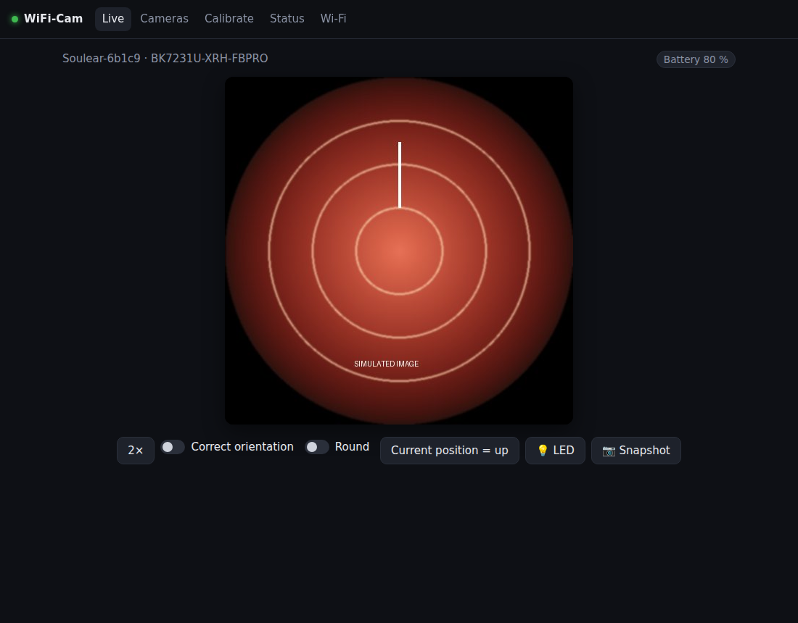
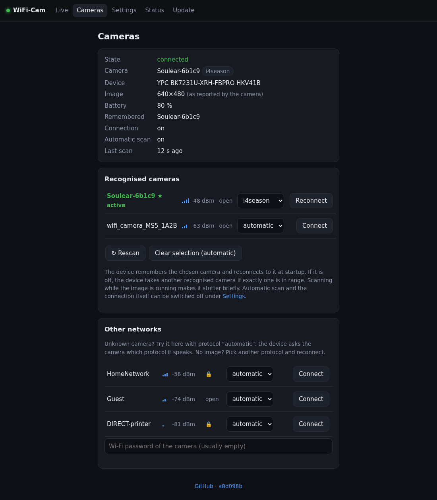
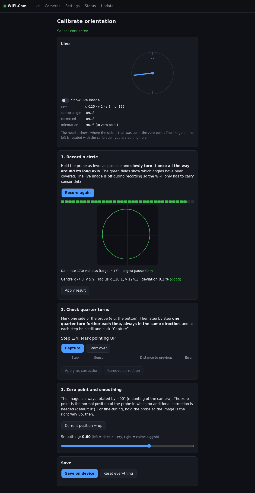
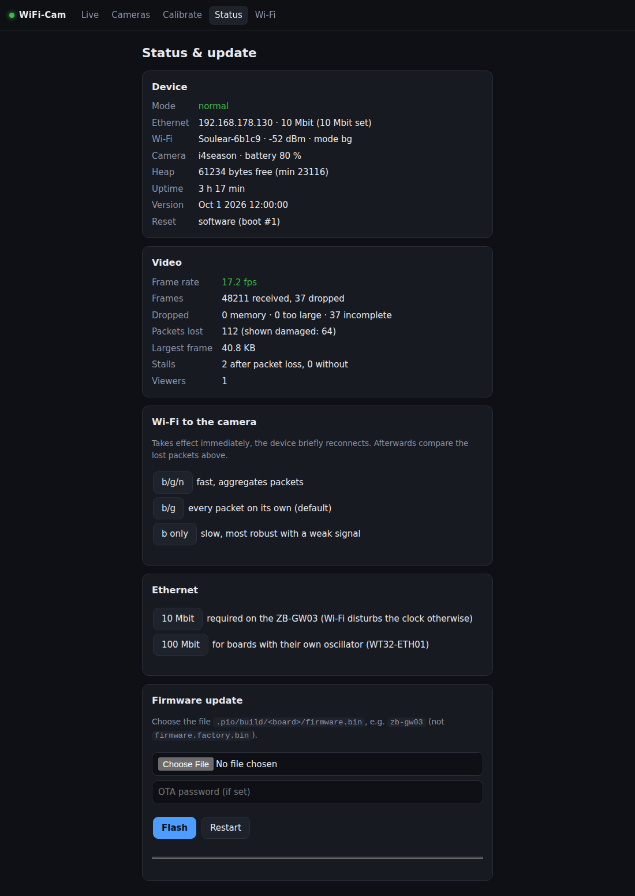
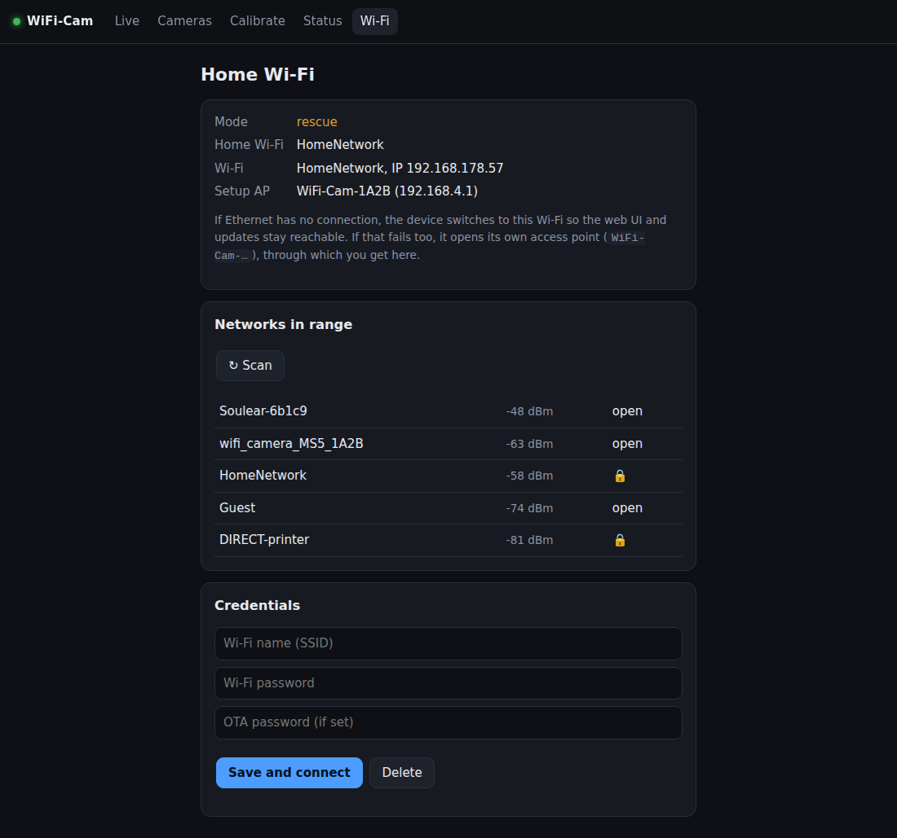
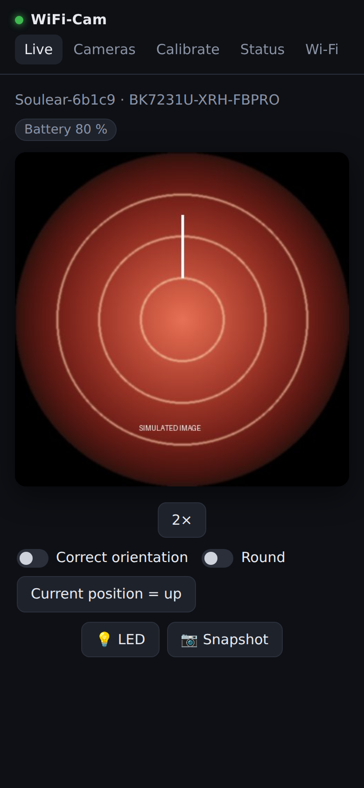

# Project documentation: WiFi-Cam-Proxy (Soulear otoscope bridge)

As of: 2026-10-01 · Author: HeikoGr

> This documentation is based on the research results in
> [handover-research.md](handover-research.md) (multi-cam protocol overview) and the
> verified measurements in [handover-esp32-bridge.md](handover-esp32-bridge.md)
> (ZB-GW03 implementation).

---

## 1. Overview

A Wi-Fi ear cleaner of the brand **Hopefox** (vendor app "Soulear",
`com.i4season.bkCamera_soulear`) transmits an MJPEG live image via a proprietary UDP protocol.
Goal: show the image **without the vendor app** in the browser, VLC and Home Assistant,
reachable from the whole home network.

Solution: a **ZB-GW03 v1.4** (Zigbee gateway, ESP32 + LAN8720) connects to the otoscope via
Wi-Fi and provides the image in the home network over Ethernet. A web UI rotates the image
automatically along with the accelerometer.

```
[Soulear otoscope] <--Wi-Fi--> [ZB-GW03 ESP32 bridge] <--Ethernet--> [home network]
 192.168.1.1                    192.168.178.130                      http://otoskop.local/
 UDP 10005/10006                 Arduino/pioarduino
```

Since then the firmware also supports other cameras (detection by SSID, see the
[README](../README.md)) and the CYD as a display device.

**State (as of 2026-09-30):** stable, 17 fps without dropouts with a good signal.
516 of 517 frames received, longest pause 92 ms.

---

## 2. Hardware

### 2.1 Soulear otoscope (Hopefox Find T)

| Property | Value |
|---|---|
| Chip | BK7231U-XRH-FBPRO (Beken BK7231U, namespace `XRH`) |
| Firmware | HKV41B |
| SSID | `Soulear-6b1c9` (open, no password) |
| IP | `192.168.1.1` (own DHCP server) |
| Client IP | `192.168.1.10` (via DHCP) |
| Resolution | 480×480 JPEG (~17–18 fps, 5–41 KB/frame) |
| Header value | wrongly reports 640×480 in bytes 12–15 |

The vendor app `Soulear` can be blocked via a server call to `yun.simicloud.com`
and requires a cloud licence check. The own bridge bypasses this completely. Source: static
app analysis in [rico001/open-web-soulear docs/README-statische-analyse.md](https://github.com/rico001/open-web-soulear).

### 2.2 ZB-GW03 v1.4 (current bridge hardware)

Zigbee gateway, reflashed with our own firmware.

| GPIO | Function |
|---|---|
| GPIO17 | 50 MHz clock for the LAN8720 (generated internally → Wi-Fi interference!) |
| GPIO16 | LAN8720 power enable |
| GPIO23 | Ethernet MDC |
| GPIO18 | Ethernet MDIO |
| GPIO14 | green LED (active LOW) |
| GPIO15 | red LED (active LOW) |
| GPIO13 | Zigbee EFR32 nRESET (LOW = in reset, saves power) |

**Critical:** at 100 Mbit Ethernet ~2–3 % of the packets are lost because Wi-Fi reception
disturbs the 50 MHz clock (GPIO17). Fix: **lock Ethernet to 10 Mbit**
(enough for 3 simultaneous MJPEG viewers at ~3 Mbit/s each).
Source: [syssi/esphome-zb-gw03](https://github.com/syssi/esphome-zb-gw03).

### 2.3 Recommended alternative: WT32-ETH01

The WT32-ETH01 board has its **own 50 MHz oscillator** (GPIO0 INPUT), which is independent
of Wi-Fi reception. This allows 100 Mbit even with Wi-Fi active.
Supported since the multi-platform extension (`-DBOARD_WT32_ETH01`).
Source: [egnor/wt32-eth01](https://github.com/egnor/wt32-eth01).

---

## 3. Protocol (i4season / libWifiCamera)

The device speaks the **i4season protocol**, which is also used by Wi-Fi microscopes (MS5), ear
scopes (AiSee, Suear) and other devices of this family. MaxSee microscopes and the MAX-VIEW speak
JHCMD instead (section 3.4).

### 3.1 Protocol header (12 bytes, little-endian)

```
Offset  Length  Type  Meaning
0       4       u32   magic: 0xFFEEFFEE (on the wire: EE FF EE FF)
4       2       u16   ID (running number, echoed back in the reply)
6       2       u16   type (command type)
8       1       u8    unk = 0x01 in requests
9       1       u8    err = 0x00 = OK
10      2       u16   length (payload length in bytes)
```

### 3.2 Command sequence

| Step | Port | Type | Payload | Status |
|---|---|---|---|---|
| GetDeviceInfo | UDP 10005 | 0x0001 | – | ✅ verified |
| START/OpenVideo | UDP 10006 | 0x0004 | 2 bytes own receive port (LE) + `00 00` | ✅ verified |
| Video data | → own port | – | 16-byte header + JPEG chunk | ✅ verified |
| LED | UDP 10005 | 0x000A | 3 bytes: op `0x11` (LED 1, write), status 0/1, brightness (`11 01 64` on, `11 00 00` off); reply = new state | ✅ verified on the Find T per king-cake, untested in our firmware |
| Battery | UDP 10005 / 10007 | 0x0001 / 0x0009 | devinfo byte `0x78 >> 1`; status push to port 10007, payload byte 1 `>> 1` | ⚠️ documented, untested in our firmware |

**Mandatory order:** GetDeviceInfo **must** come from the same socket as START
(same local IP+port). Without this step the device acknowledges START but sends no video.

The first packet after idle is often lost → always send several times.
After a START the otoscope needs ~800 ms to start up (no immediate second START!).

Protocol source: [king-cake/otoscope-windows, docs/i4season-protocol.md](https://github.com/king-cake/otoscope-windows/blob/master/docs/i4season-protocol.md)
– reverse-engineered from `libWifiCamera.so` with Ghidra and verified on a Hopefox Find T.

### 3.3 Video packet header (16 bytes)

| Byte | Meaning |
|---|---|
| 0 | always `0x01` (type 1; type 6 = 28-byte header) |
| 1 | packet number (8 bits, wraps around) |
| 2 | frame number (8 bits) |
| 3 | `0x00` normally; `0x01` on the last packet in the reference capture |
| 4 | number of packets in the frame |
| 5 | always `0x01`; bit 0 = "has G-sensor" per protocol docs |
| 6–9 | accelerometer (u32 LE): x = bits 0–9, y = 10–19, z = 20–29; bit 9 = sign, bits 0–8 = magnitude; ~128 ≙ 1 g |
| 10–11 | constant `0x66 0x90` |
| 12–15 | `0x80 0x02 0xE0 0x01` (640/480 LE) – incorrect, the real size is 480×480 |

Roll angle = `atan2(x, y)`. The axes have small offsets (x ≈ −7, y ≈ +6).
The camera is mounted rotated by 90° in the probe → frames are always rotated by −90°. This
is a property of the camera model: `rotation` in `SSID_PATTERNS` (camera.cpp), reported as
`rotation` in `/cameras.json` and used by the browser and the CYD. Unknown models: −90° if the
camera reports an orientation sensor, else 0.

### 3.4 JHCMD (MaxSee, MAX-VIEW)

Camera fixed at `192.168.29.1`. Commands to UDP 20000 (`JHCMD` + 2 bytes: `10 00`, `20 00`
init, `d0 01` start/heartbeat, `d0 02` stop), video arrives at the fixed port 10900.
Observed on a MAX-VIEW microscope (`MAXVIEW-7762`, 2026-10-01) with a raw capture
(`/camdiag/raw`):

| Byte | Meaning |
|---|---|
| 0–1 | per czietz the frame number (LE); on the MAX-VIEW `01 00` in one session, counting in another |
| 2 | number of packets of this frame (seen: 12, 20, 24) |
| 3 | packet number within the frame |
| 4 | changes without a visible pattern (`00`…`32` seen); **not** the LED level |
| 5–7 | `14 00 00` |
| payload of packet 0 | 16-byte block (`3a 01 44 20 04 00 d5 6e …`), then the JPEG (`FF D8 FF`, comment "GPEncoder") |

- 1280×720 JPEG, 34–82 KB per frame, 1450-byte packets (1442 bytes payload), `FF D9` in the
  last packet. On the ZB-GW03: 17–22 fps at RSSI −57…−64 dBm, about 3 fps with a weak signal
  (−80 dBm) or several stream viewers at once.
- **Packets arrive out of order** (e.g. 3 before 2). The firmware puts every packet at its place
  by packet number (`Frame::insert`); a frame is complete when all packets up to the one with
  `FF D9` are there. Byte 2 is only used to count losses. Checked on the host with the captured
  packets, in order and shuffled: the result is byte-identical to the original JPEG.
- **Init and heartbeat like the app** (sniffed): the init sequence (`10 00`, `20 00`, `d0 01`)
  only when connecting, then `d0 01` every 3 s. After 1 s without video the firmware only sends
  `d0 01`; the full init again only after 3 s of silence, at most every 3 s. Before, it sent the
  full init after every second of silence: with 98 KB frames that turned into up to one
  handshake per second with hardly a frame in between.
- **Receive loop:** while the video runs, the command sockets (20000, 20001) and
  `/camdiag/send` are only looked at every 50 ms, not after each of the ~1500 video packets per
  second (two empty `recvfrom` calls each); without video right after the 200 ms receive timeout.
- **LED, client → camera:** `JHCMD 20 02 <0..100>` to UDP 20000, `0` = off. Sniffed with `/sniff`
  while dimming in the MAX-VIEW app (iOS); the app sends every slider value (up to `0x61` seen,
  the camera accepts 100 as well) and the same value as `FDWN 20 00 0e 00 01 00 <v>` to UDP
  20001. The camera does not confirm it, the firmware sends twice. Checked: 0 turns the LED off
  (image black), the levels are visible on the LED. The image hardly gets darker when dimming:
  the camera's auto exposure compensates. The stream carries no feedback of the level (byte 4
  and the 16-byte block do not follow it).
- **Camera → client, UDP port 20000 of the client** (the camera sends to the client's port
  20000, so the session binds it; seen only with an 802.11n sniffer, HT40, see below):
  - `JHCMD 10 20 <level>`: the **light button on the device** was pressed (100, 60, 30, 0 in
    turn). Only the button is reported: levels set by the client are not. The same level
    follows as `FDWN 20 00 0e 00 01 00 <level>` to port 20001; the firmware listens on both,
    because UDP packets get lost on a weak Wi-Fi.
  - `JHCMD 20 00 61 …` (105 bytes), after every handshake: device information. Byte 7 is
    always `0x61`, whatever the LED does: not the level. Offset 24: name `YPC320`; offset 40:
    `0xcc` = 204, matches the end of the firmware shown by the app (`E.WH2405-20230724-204`;
    the bytes `17 07 14` after it look like a date, 2023-07-20); offset 50–52: `09 02 01`;
    offset 69: `MAXVIEW-` (start of the SSID). Identical in every session so far.
  - `JHCMD 30 05 fe 01 "v1.01abd2957bb6…"` (519 bytes), seen to the vendor app right after its
    start-up (`JHCMD 10 00`, `JHCMD 20 00`, `FDWN 20 00 09 00 00 00`); only the first 48 bytes
    are known, probably versions and a checksum. The bridge never received it, reason unknown.
- **Battery:** the vendor app asks every 5 s with `FDWN 00 00 01 00 00 00` to UDP 20001, the
  camera answers to the client's port 20001 with 48 bytes: `FDWN 00 00 01 00 1a 00 00 05 …`,
  **byte 32 = battery**, the camera's MAC at offset 40 (`60:de:f4:08:77:62`), byte 8 = 26 and
  byte 11 = 5 (not understood). The firmware sends the same query every 5 s once the video runs.
  Compared with the app's display (10 % steps, rounded down), raw → shown: 110 → 10 %, 115 → 20,
  137 → 40, 148 → 50, 152…160 → 60, 162…168 → 70, 177 → 80; the flips to 60 % lie between raw
  148 and 152, to 70 % between 160 and 162, to 80 % between 170 and 177. All of it fits
  **percent = raw − 91** (so 100 % at 191), which the firmware uses, shown rounded down to 10 %.
  Checked on one device (a nearly empty battery charged with a plain A-to-C cable); the flips to
  90 and 100 % (predicted at 181 and 191) and anything below 10 % are not checked. **While
  charging, the value is about 35 units higher** (110 → 146 within 30 s of plugging in the
  cable) and rises about one unit per minute; there is no charging flag in the answer, the app
  shows the same inflated percentage. Probably it is a voltage (it jumps when the charger is
  plugged in); it fell from 137 to 115 in 8 minutes while the microscope was running.
- Orientation: not known.
- **Sniffing the vendor app:** the camera's beacon says `11b/g/n`, secondary channel `none`,
  i.e. no 40 MHz channel. Still: the sniffer saw the camera's messages to the phone only when
  it listened in HT40 (secondary channel below); in one run with 802.11n at 20 MHz it saw
  almost nothing in that direction. Why is not understood, so `/sniff/start/9/below` is the
  setting known to work (the plain `/sniff/start` takes the beacon's HT20).
  The sniffer's ring held only the last ~13 s when the phone's video flooded it; now all UDP
  from the port that the large video packets come from is only counted.

---

## 4. Firmware architecture

### 4.1 Task distribution

| Task | Core | Priority | Job |
|---|---|---|---|
| `videoTask` | core 1 | 10 | creates the session of the active camera protocol: UDP receive, JPEG assembly, orientation, battery, LED |
| `httpTask` | core 1 | 3 | TCP accept, creates a clientTask per connection ([http.cpp](../firmware/src/http.cpp)) |
| `clientTask` | core 1 | 3 | HTTP request → response: looks the path up in `ROUTES` (method, path or prefix, password yes/no, handler) |
| `loop()` | core 1 | 1 | camera scan/selection (`cameraLoop`), rescue mode, ArduinoOTA, sniffer start/stop, FPS statistics. All `WiFi.*` calls that change the connection run here; HTTP tasks only leave requests (`cameraSelect`, `sniffRequest`) |
| `displayTask` (CYD only) | core 0 | 1 | decodes the newest frame and shows it, touch menu |

### 4.2 Frame store (frame objects)

Frames are **not stored as one contiguous block** but as a list of UDP payloads
(chunks of ~1.3 KB):

- No large `malloc()` → less heap fragmentation
- Chunks preferably in the **IRAM remainder** (~44 KB, word-addressable only) → regular heap
  stays free; word-wise copying via `volatile uint32_t*`
- Reference counting: HTTP clients hold the frame as long as they are sending it
- **Large frames (720p):** beyond `FRAME_RESERVE_FROM` (48 KB) a chunk is only taken while
  `FRAME_HEAP_RESERVE` (40 KB) stays free. With the MAX-VIEW's 50–85 KB frames the stored
  frame and the one being built did not fit together, most frames were dropped (`drop_nomem`,
  200 in 30 s measured). So when a chunk does not fit, `allocChunk` frees the stored frame if
  nobody else holds it (no stream viewer sending it, no snapshot, no CYD decoding it) and tries
  once more (`/status` `released` counts it). Viewers then get the next frame. Checked on the
  host (`tools/host-tests`, `frame_test.cpp`).
- **Heap floor:** below 48 KB no chunk is taken while less than `FRAME_HEAP_FLOOR` (16 KB)
  would stay free. On the CYD with the MAX-VIEW (display decoding one 720p frame while the
  next is built) the heap otherwise dropped to ~1.4 KB, Wi-Fi lost hundreds of packets per
  second and damaged frames showed as horizontal streaks. 16 KB was not enough there (still
  224 bytes): the Wi-Fi receive buffers alone take up to 32 x 1.6 KB in a burst. On the CYD
  floor and reserve are both 48 KB; a large frame that does not fit beside the one being
  decoded is dropped (`no mem`), the next one is taken after the decode. `[stats]` shows the
  heap minimum per 5 s interval.

- **Copying out of IRAM:** `copyFromChunk` reads whole words in a loop and handles only the
  unaligned start and the end byte by byte. `collapseFill` (JHCMD) and the CYD's JPEG reader
  pass every frame through it.
- **Waiting stream viewers** only compare the sequence number (`latestFrameSeq()`) and take the
  frame only when a new one is to be sent. Before, they held the stored frame every 5–10 ms
  just to look, and during that moment `allocChunk` could not free it (`drop_nomem`). With
  `STREAM_MAX_FPS` a viewer sleeps for the rest of the interval instead of polling every 5 ms.

**IRAM trap:** `getFreeHeap()` includes ~44 KB of IRAM that cannot be used for `malloc()` and
task stacks. The firmware therefore uses `heap_caps_get_free_size(MALLOC_CAP_INTERNAL | MALLOC_CAP_8BIT)`.

### 4.3 Non-blocking send

A blocking `send()` sleeps up to **1 s** on `ERR_MEM` (lwIP timer). The firmware sends with
`MSG_DONTWAIT` and retries after 5 ms on `EAGAIN`/`EWOULDBLOCK`.

### 4.4 ESP-IDF adjustments (`custom_sdkconfig` in platformio.ini)

| Setting | Value | Reason |
|---|---|---|
| `CONFIG_BT_ENABLED` | `n` | Bluetooth unused; saves ~14 KB IRAM |
| `CONFIG_LWIP_UDP_RECVMBOX_SIZE` | `32` (instead of 6) | a whole frame (15–30 packets) fits into the buffer |

On the first build with a changed `custom_sdkconfig` ESP-IDF is rebuilt (~4 min).

### 4.5 Ethernet: 10 Mbit and store-and-forward

**10 Mbit (ZB-GW03):** PHY negotiation set to "10 Mbit full duplex only" (PHY register
ANAR bits 5–8). Enough for 3 viewers. Switchable at runtime: `/update` or `POST /eth10/<0|1>`.

**Store-and-forward:** enabled via `EMAC_DMA.dmaoperation_mode.tx_str_fwd = 1`.
Prevents mangled packets during Wi-Fi/DMA memory bus conflicts.

### 4.6 CYD: display path and measurements

`displayTask` decodes the newest frame with JPEGDEC straight from the packet list and writes
it stripe by stripe to the display (LovyanGFX, no frame buffer: 320×240×2 = 150 KB does not
fit without PSRAM). If it is slower than the camera, frames drop out; the newest one is always
shown.

Measured on 2026-10-01 with the Soulear (480×480 JPEG, ~17 fps) on an ESP32-2432S028R (ILI9341
variant), Wi-Fi RSSI −26 to −49 dBm:

| Zoom | Visible | Draw time per frame | Shown | Lost packets |
|---|---|---|---|---|
| 1:1 (centre crop) | 320×220 | ~90 ms | ~11–12 fps | 0 |
| fit (1/2 scale) | 240×240 | 116–130 ms (max ~158) | 6.6–8.4 fps | 0 |

- **The decoder is the bottleneck, not Wi-Fi.** No packet loss, no damaged frames. "fit" is
  slower than 1:1 although it shows fewer pixels: it has to decode the whole 480×480 image,
  while 1:1 skips the blocks outside the crop.
- **SPI 80 MHz** (`CYD_SPI_WRITE_HZ`): autodetect sets 40 MHz for the ILI9341 variant (80 MHz
  for the ST7789). 80 MHz runs cleanly on the tested device. The ESP32 only divides 80 MHz
  (80, 40, 26.7, … MHz); if the image is garbled, go back to 40 MHz.
- **Tearing:** the display has no usable TE pin on the CYD, so writing cannot be synchronised
  with the panel refresh. Lower fps do not prevent it, they only make it rarer. With 80 MHz the
  visible artifacts were gone.
- **Watchdog:** because a new frame is almost always ready, the display task must yield after
  every frame (`vTaskDelay(1)`), otherwise IDLE0 trips the task watchdog after 5 s.
- **1:1 crop:** JPEGDEC moves the crop start down to a block edge (16 px) but keeps the width.
  The firmware therefore extends the crop, otherwise there was an 8 px black bar on one side.
- **MAX-VIEW (1280×720) streaks, 2026-10-02:** the camera's JPEGs have a restart interval of
  160 MCUs and pad each interval with up to 32 fill bytes `FF` before the RSTn marker
  (allowed by the standard). JPEGDEC 1.8.4 stops with a decode error at the first run of two
  or more (from row ~210 on in the captured frame); the rest of the display kept the previous
  frame: horizontal streaks, also with no packet lost. On the CYD (`JPEG_COLLAPSE_FILL`) the
  JHCMD session cuts every run in the scan data down to one `FF` before publishing. The bridge
  leaves the frames as they are: browsers decode both the same way, and it saves a pass over
  every frame.
  `[stats]` counts `decode errors`.
- **Last group of a cropped row:** JPEGDEC draws the MCUs of a row in groups (up to
  `MAX_BUFFERED_PIXELS` = 2048 px) and draws a group only once it is full. At 1:1 with 4:2:0
  (16×16 MCUs) it decodes 21 MCUs per row in groups of 8, the last 5 were never drawn: 64 px
  black at the right. The firmware picks a group size that divides the MCUs per row (7) and
  widens the crop by a few MCUs if there is no useful divisor (clip rectangle hides them).
  Checked on the host with JPEGDEC for 1280×720, 640×480 and 480×480 (4:2:0, 4:2:2, 4:4:4).
- **Rows above the crop skipped:** entropy-coded data has no positions, so JPEGDEC reads every
  row above the 1:1 crop (MAX-VIEW: rows 0–223 of 720 at full width). With restart markers
  the data of an interval does not depend on anything before it: `FrameReader`
  ([jpeg_reader.h](../firmware/include/jpeg_reader.h)) serves the header with a smaller image
  height followed by the data after the RSTn marker at which the crop row begins, the crop
  moves up accordingly. Host check with JPEGDEC: pixel-identical, 0.55 → 0.37 ms per decode
  (−33 %) for the MAX-VIEW frame at 1:1. Without DRI, or in "fit", nothing changes.
- **No waiting screen between frames:** with 720p the store gives up its frame for the next
  one (`released`); the display then briefly finds no frame. While connected and the last
  image is younger than 3 s it keeps that image instead of drawing "Waiting for image...".
- **Display size:** image path (crop, scaling, centring, overlay) and the menus are laid out
  from `lcd.width()`/`lcd.height()`; nothing assumes 320×240. A larger display gets larger
  menu buttons and more networks in the camera choice (up to 8). Another board needs its own
  `BOARD_*` block in `config.h` and LovyanGFX setup (the autodetect is limited to the CYD
  variants). Limit: in "fit" JPEGDEC scales only by 1, ½, ¼ or ⅛.
- **Overlay** (battery, fps): sits in the side border or in a 10 px strip that the image leaves
  out at 1:1, and is only redrawn when its text changes (no flicker).
- **No orientation correction:** removed. Arbitrary angles need a frame buffer, and in 90°
  steps the image kept jumping in the hand. Only the fixed rotation of the camera model remains
  (otoscope −90°), rounded to quarter turns.

Serial console (115200 baud) every 5 s:
`[stats] received 17.2 fps, shown 8.0 fps | lost pkts 0, damaged 0, incomplete 0, RSSI -46 | draw avg 121 ms max 140 ms | battery 55% | heap 148412 (min 107600)`.
`damaged` > 0 means Wi-Fi artifacts; a `[geo]` line shows the image geometry whenever it changes.

---

## 5. HTTP API

| Endpoint | Method | Description |
|---|---|---|
| `/` | GET | live image with orientation correction, 2× zoom and LED switch |
| `/stream` | GET | MJPEG stream (for VLC, Home Assistant) |
| `/snapshot` | GET | single frame (JPEG) |
| `/calibrate` | GET | calibrate orientation (circle recording, quarter turns, zero point) |
| `/calibration` | GET/POST | calibration data as JSON |
| `/style.css`, `/app.js` | GET | shared style sheet and scripts of the pages |
| `/update` | GET | status, Wi-Fi mode, Ethernet speed, firmware update, restart |
| `/update` | POST | firmware update (binary, `application/octet-stream`) |
| `/status` | GET | all counters as JSON |
| `/camdiag` | GET | first packets of the current camera session as hex (text) |
| `/camdiag/raw` | GET | raw capture of one whole frame (all UDP packets with headers): first call requests it (202), the next one fetches it; freed after 30 s if nobody fetches it |
| `/camdiag/send/<port>/<hex>` | POST | experiment: the camera session sends these bytes (max. 64) to the camera's port from its command socket; the camera's messages appear in `/camdiag` |
| `/led/level/<0..100>` | POST | LED brightness in % for dimmable cameras (JHCMD), 0 = off |
| `/led` | GET | `{"led":0\|1,"level":%}`: small state for the live page's one-second polling (no 3 KB buffer like `/cameras.json`) |
| `/sniff/start[/<channel>[/above\|below\|none]]` | POST | sniffer: leave the camera Wi-Fi, record the UDP/TCP traffic of the vendor app with the camera (without UDP video) on the camera's channel, 11n, HT40 as in its beacon |
| `/sniff`, `/sniff/stop` | GET / POST | read the recording as text / stop and reconnect. The recording (18 KB) is freed on stop, so read it first |
| `/wifi-setup` | GET/POST | home Wi-Fi for rescue mode (form `ssid`, `pass`) |
| `/eth10/<0\|1>` | POST | Ethernet 10 Mbit on/off |
| `/orientation` | GET | server-sent events: orientation sensor ~17×/s |
| `/led/0`, `/led/1` | POST | camera LED off/on (i4season 0x0A, waits for confirmation; JHCMD: on = last brightness) |
| `/cameras` | GET | choose camera (scan list, selection) |
| `/cameras.json` | GET | camera state, telemetry (battery, LED, device), `rotation` of the image for display (degrees, CSS direction; per camera model), scan list |
| `/cameras/scan` | POST | scan again |
| `/cameras/select` | POST | form `ssid`, `pass`, `proto` (`auto`/`i4season`/`jhcmd`); empty SSID = clear selection |
| `/cameras/autoscan/<0\|1>` | POST | automatic scan off/on (stored in NVS). Off: no scans of its own, only reconnects to the remembered camera |
| `/wifi/<bgn\|bg\|b>` | POST | switch the Wi-Fi mode towards the camera |
| `/wifi/tx/<8..84>` | POST | Wi-Fi transmit power in 0.25 dBm |
| `/restart` | POST | restart |

With `OTA_PASSWORD` set (header `X-OTA-Password`, a wrong one gives 401): `POST /update`, `/restart`,
`/eth10/…`, `/wifi/…`, `POST /wifi-setup`, `/cameras/select`, `/cameras/autoscan/…`,
`/sniff/start`, `/sniff/stop`, `/camdiag/send/…`. Open: all GET routes, the LED routes,
`/cameras/scan` and `POST /calibration` (the calibration page has no password field).

| Live view | Cameras | Calibration |
|---|---|---|
|  |  |  |
| **Status & update** | **Wi-Fi setup (rescue mode)** | **Phone** |
|  |  |  |

Screenshots from [tools/ui-preview](../tools/ui-preview/) (simulated data, generated test image).
The pages share `/style.css` and `/app.js`; no external resources are loaded.

**Home Assistant** (MJPEG camera):
```yaml
camera:
  - platform: mjpeg
    name: Otoscope
    mjpeg_url: http://otoskop.local/stream
```

---

## 6. Configuration

### 6.1 Compile time ([firmware/include/config.h](../firmware/include/config.h))

Board selection via `build_flags` in `platformio.ini`:
- `-DBOARD_ZB_GW03` (default, 10 Mbit limit)
- `-DBOARD_WT32_ETH01` (100 Mbit, no Zigbee)
- `-DBOARD_CYD` (display instead of Ethernet)

Important constants:

| Constant | Default | Meaning |
|---|---|---|
| `MAX_STREAM_CLIENTS` | 3 | max. simultaneous MJPEG viewers |
| `STALL_TIMEOUT_MS` | 200 | silence → repeat handshake |
| `HANDSHAKE_RETRY_MS` | 800 | minimum interval between STARTs |
| `SHOW_DAMAGED_FRAMES` | 1 (CYD: 0) | show (1) or drop (0) frames with packet loss |
| `WIFI_MODE_DEFAULT` | `"bg"` | Wi-Fi mode without 11n (every packet on its own) |
| `MAX_FRAME_BYTES` / `FRAME_RESERVE_FROM` / `FRAME_HEAP_RESERVE` | 96 / 48 / 40 KB (CYD: 48 KB) | largest frame; beyond 48 KB only while 40 KB heap remain free |
| `FRAME_HEAP_FLOOR` | 16 KB (CYD: 48 KB) | no frame chunk from the heap below this, whatever the frame size |
| `STREAM_MAX_FPS` | 5 on the ZB-GW03 (10 still stuttered), else 0 (unlimited) | frames per second per stream viewer; the newest frame is sent, the ones in between are skipped. The 720p MAX-VIEW (~22 fps, 33–84 KB) needs 6–15 Mbit/s, more than the 10 Mbit Ethernet of the ZB-GW03 carries |

### 6.2 Runtime (NVS, namespace `otoskop`)

| Key | Content | Set via |
|---|---|---|
| `calib` | orientation calibration (JSON) | `/calibrate` |
| `wifimode` | `bgn`/`bg`/`b` | `/update` |
| `wifitx` | Wi-Fi transmit power (0.25 dBm) | `POST /wifi/tx/<value>` |
| `eth10` | Ethernet 10 Mbit (default: on) | `POST /eth10/<0\|1>` |
| `home_ssid`, `home_pass` | home Wi-Fi for rescue mode | `/wifi-setup` |
| `cam_ssid`, `cam_pass`, `cam_proto` | last connected camera | `/cameras` |
| `cam_autoscan` | automatic scan on/off (default on) | `/cameras` |
| `cyd_zoom`, `cyd_bright` | CYD settings | CYD touch menu |

### 6.3 Secrets ([firmware/include/secrets.h](../firmware/include/secrets.h))

The file `secrets.h` is in `.gitignore` and must **never be committed**.
Template: [firmware/include/secrets.example.h](../firmware/include/secrets.example.h)

```cpp
#define HOME_WIFI_SSID     ""                  // optional default, /wifi-setup takes precedence
#define HOME_WIFI_PASSWORD ""
// #define SETUP_AP_PASSWORD "my-ap-password"  // setup access point, at least 8 characters
// #define OTA_PASSWORD    "update-password"   // optional
```

---

## 7. Building and flashing

### 7.1 VS Code (recommended workflow)

`./setup-build-env.sh` installs PlatformIO into `.venv`; the tasks in
[.vscode/tasks.json](../.vscode/tasks.json) use it. With the extension **`actboy168.tasks`**
all tasks appear as buttons in the status bar.

Recommended extensions (in [.vscode/extensions.json](../.vscode/extensions.json)):
- `actboy168.tasks` – task buttons in the status bar
- `ms-vscode.cpptools` – C/C++ IntelliSense
- `ms-vscode.serial-monitor` – serial monitor

**IntelliSense:** without the PIO extension the C/C++ extension does not know the ESP32
framework's include paths and defines and reports errors that the compiler never sees
(`DNSServer.h` not found, `arduino_panic_info_t` undefined, …). `tools/gen-compiledb.sh`
writes `firmware/compile_commands.json` with the real compiler calls (`pio run -t compiledb`
for the ZB-GW03, plus `main_cyd.cpp` from the CYD build); `.vscode/settings.json` points
IntelliSense at it. `setup-build-env.sh` runs it; after changes to `platformio.ini` or new
source files run the task **Refresh IntelliSense**. The file has machine-specific paths and is
not committed.

**About the PIO IDE extension:** the official `platformio.platformio-ide` extension is very
heavy and takes very long to load the first time (large PIO Core download). Since this project
gets by with the PIO CLI alone (`pio run`, `pio device monitor`), the extension is
**optional**. The CLI is faster and shows the same compiler error messages.

### 7.2 Important build commands

```bash
cd firmware

# Build
pio run -e zb-gw03

# First flash (USB-UART, GPIO0 to GND at power-on)
pio run -e zb-gw03 -t upload --upload-port /dev/ttyUSB0

# OTA via HTTP
pio run -e zb-gw03-http -t upload

# OTA via espota (ArduinoOTA)
pio run -e zb-gw03-ota -t upload

# CYD (USB, auto-reset)
pio run -e cyd -t upload

# Serial monitor
pio device monitor
```

### 7.3 OTA update in the browser

`http://otoskop.local/update` → upload `.pio/build/zb-gw03/firmware.bin`
(**not** `firmware.factory.bin`).

### 7.4 Resolving a backtrace

```bash
~/.platformio/packages/toolchain-xtensa-esp-elf/bin/xtensa-esp32-elf-addr2line \
  -pfiaC -e firmware/.pio/build/zb-gw03/firmware.elf \
  0x4008bf04 0x4008bec9 …
```

The `.elf` must match the running firmware (from the same build).

---

## 8. Multi-platform strategy

The firmware compiles for different ESP32 boards. The board is selected via `-DBOARD_<NAME>`
in `platformio.ini`.

| Board | ETH clock | Max. Ethernet | LED polarity | Zigbee |
|---|---|---|---|---|
| ZB-GW03 v1.4 | GPIO17 OUT (internal) | **10 Mbit** (Wi-Fi limit) | active LOW | EFR32, disabled |
| WT32-ETH01 | GPIO0 IN (external) | 100 Mbit | active HIGH | none |
| CYD ESP32-2432S028R | – | no Ethernet (display) | RGB LED switched off | none |

For new hardware: WT32-ETH01 recommended (~8 €, no 10 Mbit limit).
For further boards: a new section in `config.h` and a new `[env:...]` in `platformio.ini`.

---

## 9. Rescue mode

If Ethernet has no IP for 30 s, the red LED turns on and the device switches to rescue mode:

1. If a home Wi-Fi is set up, it connects to it. The web UI and OTA then stay reachable under `otoskop.local`. You set the home Wi-Fi under `/wifi-setup`, it is then stored in NVS. As a fallback the device uses `HOME_WIFI_SSID` from `secrets.h`.
2. If none is set up or it cannot be reached for 30 s, the device opens its own access point `WiFi-Cam-XXXX` (password `SETUP_AP_PASSWORD`, default `wificam-setup`). After connecting, the phone opens the setup page by itself (captive portal), otherwise open `http://192.168.4.1/wifi-setup`. There you scan for networks and store the home Wi-Fi; the device connects right away. While the AP is running, it retries the home Wi-Fi every 5 minutes as long as nobody is connected to the AP.
3. Once Ethernet has been back stably for 10 s, the device restarts into normal operation.

The camera is idle in rescue mode because Wi-Fi is then needed for reachability.

---

## 10. Diagnostics

| Source | Content |
|---|---|
| `/status` | JSON: all counters since start, `last_crash` = backtrace of the last crash |
| serial console | events (`/log` and `/sensor` were removed to save ~6 KB heap) |
| `/camdiag` | camera IP, the first video packets, the camera's messages and unusual packets of the session as hex (a ring: the oldest lines go): for unknown cameras |
| `/camdiag/raw` | one whole frame as received (binary), e.g. to work out a packet format |
| `stalls_loss` | dropouts after packet loss → weak Wi-Fi signal |
| `stalls_clean` | dropouts without packet loss → otoscope pauses by itself |

---

## 11. LED and battery (i4season: battery confirmed on the CYD, LED untested; JHCMD: see 3.4)

Following [king-cake/otoscope-windows docs/i4season-protocol.md](https://github.com/king-cake/otoscope-windows/blob/master/docs/i4season-protocol.md):

- **LED:** command `0x000A` to **UDP 10005** with 3 bytes (`11 01 64` = on, `11 00 00` = off). The
  camera replies with the new state. The firmware repeats the command up to 5× at 300 ms intervals
  until the reply arrives. Only then does the start page show the LED as on or off.
  (An earlier version sent 1 byte to port 10006, which was wrong.)
- **Battery:** from the devinfo reply at handshake (byte `0x78 >> 1`) and from the status push the
  camera sends to UDP 10007 about once per second. Bit 0 probably means "charging". (JHCMD
  cameras: see 3.4, byte 32 of the status answer.)

Shown on the start page, in `/cameras.json` (`battery`, `charging`, `led`) and in `/status`.

---

## 12. Open ideas

| Idea | Source/hint |
|---|---|
| Test the LED on the device | see section 11 (battery confirmed) |
| Lower the resolution for 720p microscopes (`0x0E` SetCameraConfig) | saves RAM; caution, a mode change can block the encoder (MS5) |
| Query the resolution (`GetCameraConfig`, 0x0D) | caution: a mode change can block the encoder (observed on the MS5) |
| Put the WT32-ETH01 into operation (100 Mbit, cheaper) | multi-platform already implemented |
| Keep observing the otoscope's regular pauses | every ~25 s, cause unclear |
| Set up Home Assistant | `platform: mjpeg`, URL `/stream` |
| Multi-cam proxy (Linux, several cameras at once) | concept in [handover-research.md](handover-research.md) section 4; other families: EarFairy, JEGOAT, Xylla |

---

## 13. Known limitations

- No PSRAM: GPIO16/17 are used for Ethernet. Only ~120 KB RAM + ~58 KB IRAM.
- Orientation correction only in the browser (CSS rotation). The CYD shows the image turned by the fixed rotation of the camera model (otoscope −90°), VLC/Home Assistant get the raw image.
- Dropouts at Wi-Fi RSSI < −70 dBm. Fix: place the ZB-GW03 closer to the otoscope.
- The camera serves only the client that connected last: the vendor app and the bridge cannot
  be used at the same time (observed with the Soulear and the iOS app).
- 720p microscopes (frames above 48 KB): only one stream viewer, the newest wins. With several
  viewers each one held a 50–80 KB frame, the heap fell to ~0.5 KB and the Wi-Fi stalled.
- No custom firmware for the otoscope: the BK7231U community has no camera driver.

---

## 14. References

| Source | Relevance |
|---|---|
| [pedrodinisf/otoscope-viewer](https://github.com/pedrodinisf/otoscope-viewer) | same hardware (AiSee/BK7231U/XRH), protocol cheat sheet, test fixtures |
| [Fyfar/ms5-wifi-microscope](https://github.com/Fyfar/ms5-wifi-microscope) | most detailed i4season protocol docs (all types, resolution, LED 0x0A) |
| [king-cake/otoscope-windows](https://github.com/king-cake/otoscope-windows) | `docs/i4season-protocol.md` (from Ghidra analysis), verified on the Find T |
| [rico001/open-web-soulear](https://github.com/rico001/open-web-soulear) | Node.js proxy, static app analysis (cloud lock) |
| [SeanPesce/Suear-Web-Viewer](https://github.com/SeanPesce/Suear-Web-Viewer) | MJPEG mirror for Suear (same family) |
| [czietz/wifimicroscope](https://github.com/czietz/wifimicroscope) | MaxSee/JoyHonest protocol (`JHCMD`) |
| [syssi/esphome-zb-gw03](https://github.com/syssi/esphome-zb-gw03) | pinout ZB-GW03 v1.4 |
| [egnor/wt32-eth01](https://github.com/egnor/wt32-eth01) | pinout WT32-ETH01, ETH_CLOCK_GPIO0_IN |
| [pioarduino/platform-espressif32](https://github.com/pioarduino/platform-espressif32) | PlatformIO platform with Arduino core 3.x and `custom_sdkconfig` |
| [Elektroda: Taixen TXW816](https://www.elektroda.com/news/news4129331.html) | BK7231U UART/firmware dump (background) |
